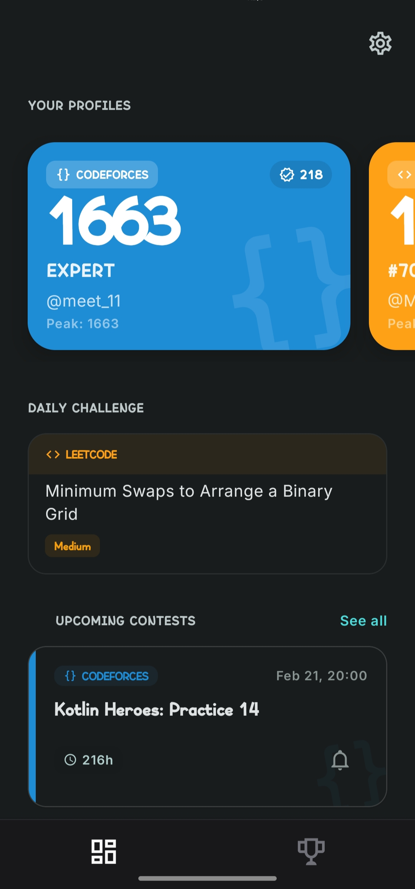
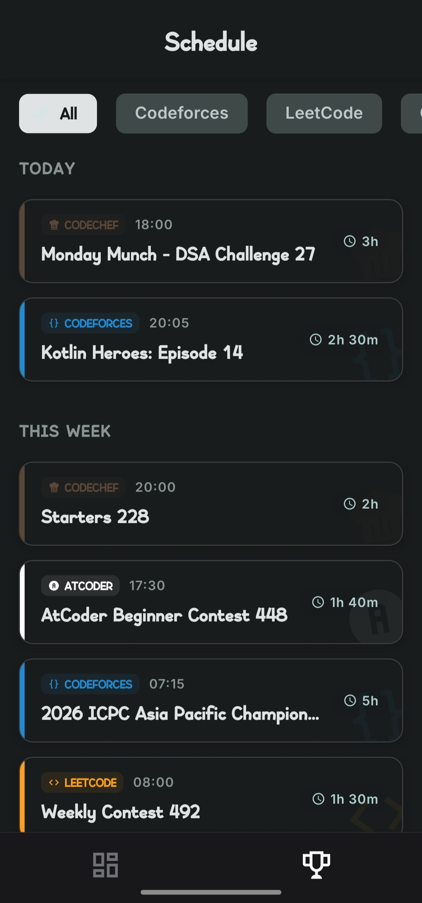
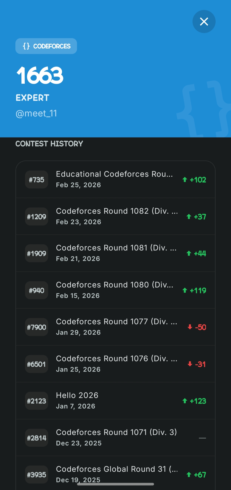
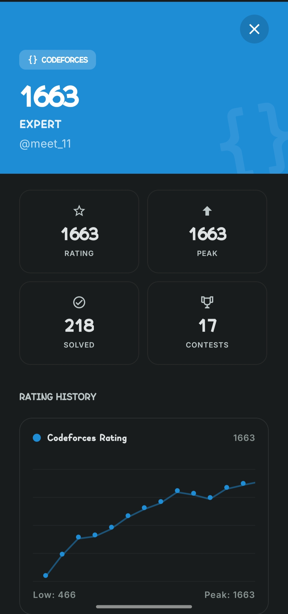

# ⏳ Krono

A sleek, modern mobile app for competitive programmers — track contests, sync profiles, and monitor your rating across **Codeforces**, **LeetCode**, **AtCoder**, and **CodeChef**.

Built with **React Native (Expo)** and **Material Design 3**.

---

## 📱 Screenshots

<p align="center">
  
  
  
  
</p>

---

## ✨ Features

- **🏆 Multi-Platform Contests** — Live, upcoming, and past contests from Codeforces, LeetCode, AtCoder, and CodeChef in one view.
- **📊 Profile Sync** — Connect your handles to see live ratings, global ranks, and solved problem counts.
- **📈 Rating Graphs** — Interactive rating history charts for every platform.
- **📋 Contest History** — Browse your recent contest results with rank and rating change.
- **🔔 Smart Reminders** — Get notified before contests start.
- **🌙 Dark & Light Mode** — Beautiful UI with Material You theming.

---

## 🛠️ Tech Stack

| Layer      | Technology                                               |
| ---------- | -------------------------------------------------------- |
| Framework  | React Native + Expo SDK 52                               |
| UI         | React Native Paper (Material Design 3)                   |
| State      | Zustand                                                  |
| Navigation | Expo Router                                              |
| APIs       | Codeforces API, LeetCode GraphQL, AtCoder JSON, Clist.by |
| Storage    | AsyncStorage                                             |

---

## 🚀 Getting Started

### Prerequisites

- Node.js v18+
- npm or yarn
- Android Emulator / iOS Simulator / Expo Go on a physical device

### Setup

```bash
# Clone
git clone https://github.com/MeetThakur/Krono.git
cd Krono

# Install dependencies
npm install

# Configure environment variables
cp .env.example .env
# Edit .env and add your Clist.by API key

# Start development server
npm start
```

Press `a` for Android, `i` for iOS, or scan the QR code with Expo Go.

### Environment Variables

| Variable                     | Description                               |
| ---------------------------- | ----------------------------------------- |
| `EXPO_PUBLIC_CLIST_API_KEY`  | Your [Clist.by](https://clist.by) API key |
| `EXPO_PUBLIC_CLIST_USERNAME` | Your Clist.by username                    |

Get your API key at [clist.by/api/v4/doc](https://clist.by/api/v4/doc/).

---

## 📝 Configuration

Customize via the in-app **Settings** screen:

- Toggle Dark / Light mode
- Enable background sync
- Manage notification timing
- Clear local cache

---

Made with ❤️ by Meet
